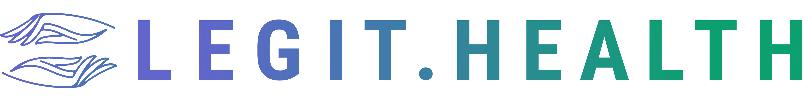
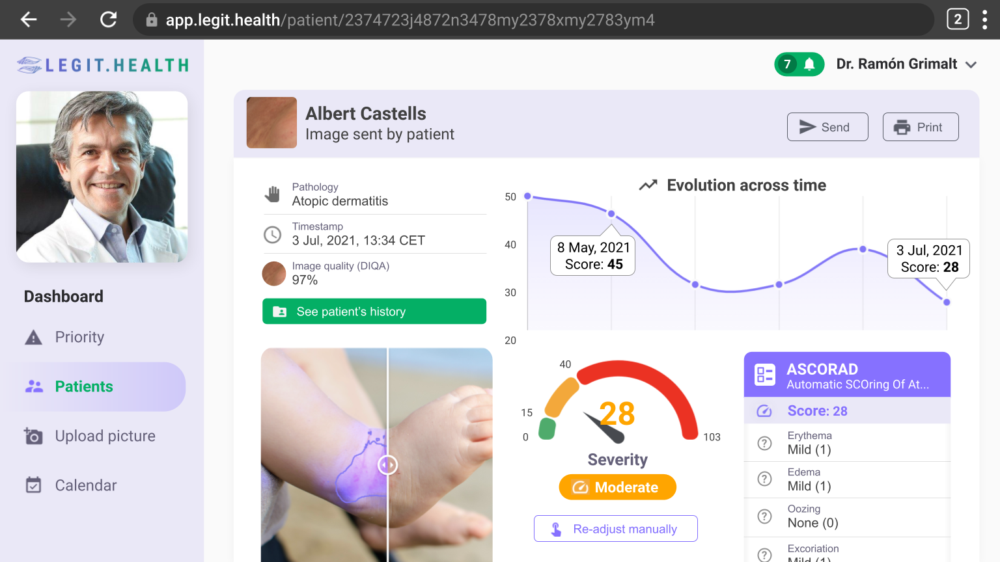
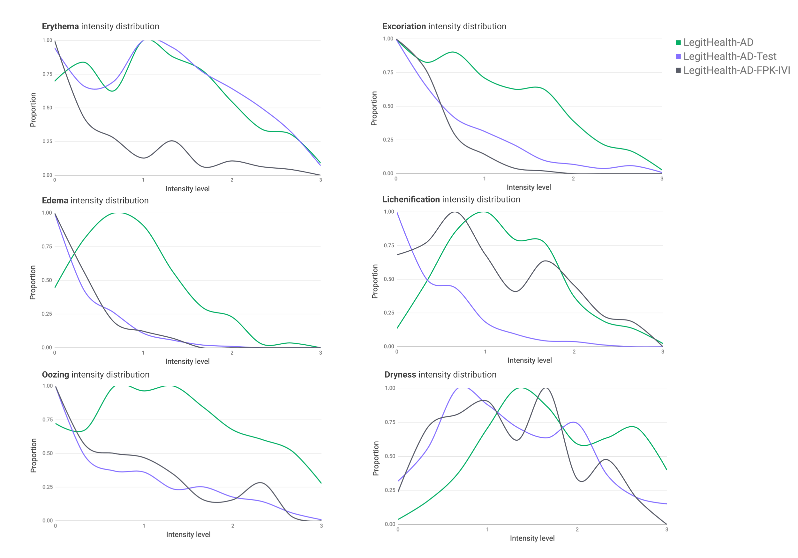
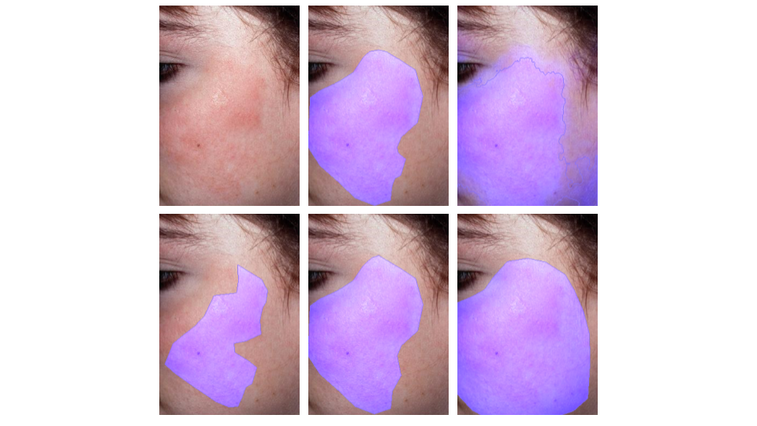
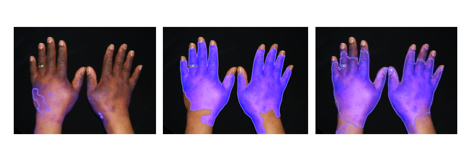

# ASCORAD: Automatic Scoring of Atopic Dermatitis
[](https://www.fast.ai/)
[](https://pytorch.org/)
[](https://opencv.org/)

[](https://legit.health/)

## Table of contents
- [What is ASCORAD?](#what-is-ascorad)
- [Datasets](#datasets)
- [Method](#method)
- [Results](#results)
- [The paper](#reference)
- [Contact](#contact)


## [What is ASCORAD?](https://legit.health/)

Objective, reliable, and precise outcome measures are a prerequisite to evidence-based health care. When considering atopic dermatitis, the SCORAD have proven to have the best measurement properties and is one of the most recommended for use in clinical trials. However, the SCORAD shows, as with all other manual scoring systems, **intra and interobserver disagreements**. The variation in scores is about 20%. As well as that, filling up the sheet has proven to be too tedious for some dermatologists. The [traditional] SCORAD system takes time and even experienced dermatologists will require seven (7) minuntes in total – an inexperienced physician will need 10 min (Oranje, A. P., Glazenburg, E. J., Wolkerstorfer, A., & de Waard-van der Spek, F. B. (2007).

ASCORAD is a fast, accurate and **fully automatic scoring system** for the severity assessment of atopic dermatitis.

We consider the **ASCORAD** to be the Next-Generation in the evolution of scoring atopic dermatitis, that stater with the [pen-and-paper version](https://legit.health/ascorad-atopic-dermatitis-automatic-scoring-system/#ib-toc-anchor-2) developed in 1993, then evolved into [online calculators](https://legit.health/ascorad-atopic-dermatitis-automatic-scoring-system/#ib-toc-anchor-3), and finally the [ASCORAD (Automatic SCOring of Atopic Dermatitis)](https://legit.health/ascorad-atopic-dermatitis-automatic-scoring-system/)


The following table offers a comparison between the clinimetric properties of deploying the SCORAD scoring system.

||Pen and Paper|Digital|Automatic (AI)|
|--- |--- |--- |--- |
|Self Supervision|–|–|Performs diagnosis|
|Ease of use|≈ 600 seconds|≈ 420 seconds|≈ 23 seconds|
|Sensitivity to change|0 to 4|0 to 4|0 to 100|
|Interobserver variability|Medium (20%)|Medium (20%)|Lowest (8%)|
|Intra-observer variability|High|High|Zero|
[Comparison of SCORAD scoring systems methods](https://legit.health/ascorad-atopic-dermatitis-automatic-scoring-system/#ib-toc-anchor-7)

The following screen capture of the application [https://app.legit.health](https://app.legit.health) offers an example of how the developers deploy the ASCORAD in a web interface that acts as a clinical decision support tools, and empowers patients by giving the the hability of submitting images that are automatically evaluated by the ASCORAD.



## Datasets

*SCORADNet* was train and tested using three datasets:

- **LegitHealth-AD**. 604 images that belong to Caucasian patients, of which one third are children, suffering from atopic
dermatitis with lesions present on different body parts.
- **LegitHealth-AD-Test**. 367 images that belong to Caucasian patients and were gathered from several dermatological atlases available online. 
- **LegitHealth-AD-FPK-IVI**. 112 images collected from online dermatological atlases that contain photos of patients with IV, V and VI skin types suffering from atopic dermatitis.


In order to run the code, the datasets have to be placed in a directory (*DATASET_ROOT_PATH*) following this scheme:

```
├── 📁 DATASET_ROOT_PATH
│   |
│   ├── 📁 LegitHealth-AD
│   │   ├── 📁 images
│   │   ├── 📁 labels
│   |   |   ├── 📁 visual_sign_assessment
│   |   |   ├── 📁 lesion_segmentation
│   |   |   |   ├── 📁 ground_truth_masks
│   |   |   |   ├── 📁 masks
|   |
│   ├── 📁 LegitHealth-AD-Test
│   ├── 📁 LegitHealth-AD-FPK-IVI
│   ├── 📁 LegitHealth-HealthySkin
```

The distributions of the visual sign intensities are quite different on each dataset, as it can be seen in the following figure:




## Method
The ASCORAD calculation can be divided in two parts, lesion surface segmentation and visual sign severity assessment. We trained two separated models, one for each task, and named SCORADNet to the neural networks involved in the calculation of the ASCORAD. We used a **U-Net** with **Resnet-34** backbone for segmentation and a multi-output (6) **EfficientNet-B0** for classification.

## Results
### Lesion segmentation

Resultson on Caucasian skin (LegitHealth-AD-Test) LegitHealth-AD-Test are very promising, obtaining an IoU greater than 50%, 75% F1 and an outstanding AUC of 93%.

Metrics on LegitHealth-AD-Test and LegitHealth-AD-FPK-IVI
|  Skin type      | Accuracy | AUC   | IoU   |   F1  |
|:--------------:|:--------:|-------|-------|:-----:|
| Fitzpatric I,II,III |   84.54  | 93.06 | 63.86 | 74.45 |
| Fitzpatric IV,V,VI |   79.18  | 86.57 | 44.86 | 55.21 |




Results on darker skin improve including dark skin samples on the training set, however, metrics do not get as good as with Causasian skin. This is due to the small amount of images of dark skin. We have proved that results improve adding just a few images, and this is promising to create a model that performs well on the whole Fitzpatrick scale in the future.


There is a significant difference between the model from experiment 1 to the second one on darker skin, which can be seen in the following example. The image from the left shows the predicted mask from experiment 1 and the second one the mask predicted with the model trained on experiment 2. In the second case, the image corresponds to the test split.



### Visual sign severity grading
#### Finding the optimal parameters
In this experiment we proved the hypothesis that a larger range contributes to lower RMAE values. We obtained 0.7-1% better results with [0, 100] range that in the original [0, 3] range. In addition, we found out that training with the median of the annotators as the ground truth gets better results.

| Experiment |  Range  | GT statistic | Upsampling | RMAE 1 (v2) | RMAE 2 (v2) | RMAE 1 (v3) | RMAE 2 (v3) |
|------------|:-------:|:------------:|:----------:|:-----------:|:-----------:|:-----------:|:-----------:|
| 1          |  [0,3]  |    Median    |     No     |     13.6    |     14.3    |     21.2    |     20.8    |
| 1          |  [0,10] |    Median    |     No     |     14.3    |     13.2    |     22.8    |     20.0    |
| 1          | [0,100] |    Median    |     No     |     14.4    |     **13.0**    |     22.6    |     **19.8**    |
| 2          | [0,100] |     Mean     |     No     |     13.5    |     13.4    |     21.1    |     19.9    |


Using the range [0, 100], the median ground truth for training gave the best RMAE result, with 12.2% for LegitHealth-AD-Test and 17.8% for LegitHealth-AD-FPK-IVI.


## Reference
[Automatic SCOring of Atopic Dermatitis using Deep Learning (ASCORAD): A Pilot Study](https://www.jidinnovations.org/article/S2667-0267(22)00014-5/fulltext)

## Funding
We thank the Basque Country government and the European Union (European Regional Development Fund 2021-2027 (ERDF)) for financial support through Hazitek program at its 2022 call (project ref: ZL-2022/00113)

## Contact
[Alfonso Medela](https://www.linkedin.com/in/alfonsomedela/) \
[Taig Mac Carthy](https://www.linkedin.com/in/taigmaccarthy/) \
[Andy Aguilar](https://www.linkedin.com/in/andy-aguilar/) 
